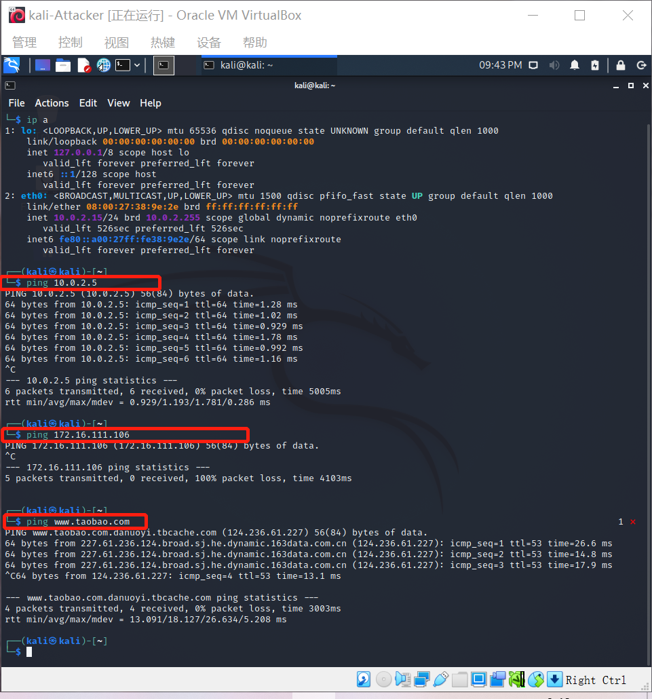

#  HTTP代理服务器实验

## 实验要求

- 在Kali Linux中安装tinyproxy
- 用主机设置浏览器代理指向tinyproxy建立的HTTP正向代理
- 在Kali中用wireshark抓包，分析抓包过程
- 理解HTTP正向代理HTTPS流量的特点

## 实验环境

拓扑结构


## 实验步骤

#### 1.连通性测试

攻击者可以ping通网关，不能ping通靶机，可以上网



网关可以ping通攻击者，可以ping通靶机，可以上网


靶机可以ping通攻击者，可以ping通网关，可以上网


#### 2.安装并使用tinyproxy

在网关上下载tinyproxy，并进行配置，之后开启tinyproxy服务

```
apt-get update & apt-get install tinyproxy
# 备份tinyproxy配置文件
cp /etc/tinyproxy/tinyproxy.conf /etc/tinyproxy/tinyproxy.conf.bak
# 编辑tinyproxy配置文件
vim /etc/tinyproxy/tinyproxy.conf
# 开启tinyproxy服务
systemctl start tinyproxy
#重启tinyproxy服务
systemctl restart tinyproxy.service
#查看tinyproxy服务状态
systemctl status tinyproxy.service

```

这里必须`Allow 10.0.2.0/24`，否则不能访问靶机

修改后要重启tinyproxy服务


#### 3.在攻击者主机的浏览器中配置代理服务


#### 4.在靶机上开启web服务

```
cd /var/www/html 

ls
#index.html  index.nginx-debian.html

sudo touch server.php 

sudo vim server.php  

php -S 0.0.0.0:8080
#[Fri Sep 24 00:02:50 2021] PHP 7.4.15 Development Server (http://0.0.0.0:8080) started


```


#### 5.使用tinyproxy访问靶机

在攻击者的firefox上配置并选择启用代理服务器后，同时在攻击者、网关、靶机开启抓包

##### 攻击者

使用firefox访问靶机172.16.111.106/8080，显示Apache默认页面，没有直接给出代理服务器信息


打开wireshark进行抓包，经过过滤后查看：Http响应中有`Via: 1.1 tinyproxy (tinyproxy/1.10.0)`字段


##### 网关

网关用`tcpdump -s 65535 -i enp0s3 -w proxy-attacker.pcap`进行抓包

将网关上抓到的包存到主机用wireshark进行查看，也可以看到Http响应中有`Via: 1.1 tinyproxy (tinyproxy/1.10.0)`字段


开启访问日志，可以看到攻击者主机访问靶机的记录


##### 靶机

开启wireshark抓包分析，过滤后也可以看到：Http响应中有`Via: 1.1 tinyproxy (tinyproxy/1.10.0)`字段


#### 6.使用tinyproxy访问https页面

在攻击者主机上用firefox访问[https://www.baidu.com](https://www.baidu.com/)，同时在网关上进行抓包

之前使用http协议访问靶机时，代理服务器（即网关）可以直接看到用户访问的网址，HTTP请求和响应的信息都是以明文形式展现

使用https，代理服务器（即网关）能看到用户访问的网址，但是传输的数据被加密了。从抓到的数据包来看，在TLS协议前还有一个和代理服务器建立连接的的过程，经过密钥交换和密钥协商后，用户和目标网站的通信都进行了加密


## 实验总结

- 通过代理服务器可以绕过某些访问限制
- 代理服务器可以看到用户访问的网址
- 代理服务器无法看到https通信数据，但是存在实现中间人攻击的可能

## 参考链接

[CUCCS/2018-NS-Public-jckling](https://github.com/CUCCS/2018-NS-Public-jckling/blob/master/ns-0x03/3.md)

[ 第三章 网络安全应用基础](https://c4pr1c3.gitee.io/cuc-ns/chap0x03/main.html)

[网络安全 第三章p19-p28](https://www.bilibili.com/video/BV1CL41147vX?p=23)