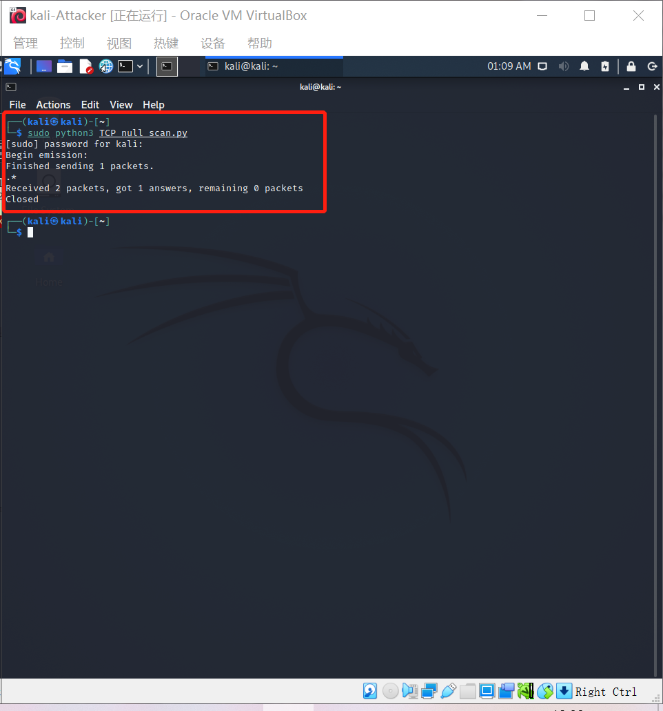

# 基于 Scapy 编写端口扫描器

[TOC]


## 实验目的

- 掌握网络扫描之端口状态探测的基本原理

## 实验环境

- python + [scapy](https://scapy.net/)

- 攻击者主机（Attacker）：Kali-Linux-2021.2

- 网关（Gateway, GW）：Debian 10

- 靶机（Victim）：Kali-Linux-2021.2

  网络拓扑如下：

  

## 实验要求

- [x] 禁止探测互联网上的 IP ，严格遵守网络安全相关法律法规
- [x] 完成以下扫描技术的编程实现
  - TCP connect scan / TCP stealth scan
  - TCP Xmas scan / TCP fin scan / TCP null scan
  - UDP scan
- [x] 上述每种扫描技术的实现测试均需要测试端口状态为：`开放`、`关闭` 和 `过滤` 状态时的程序执行结果
- [x] 提供每一次扫描测试的抓包结果并分析与课本中的扫描方法原理是否相符？如果不同，试分析原因；
- [x] 在实验报告中详细说明实验网络环境拓扑、被测试 IP 的端口状态是如何模拟的
- [x] （可选）复刻 `nmap` 的上述扫描技术实现的命令行参数开关

## Scapy 基础

```python
# 导入模块
from scapy.all import *
# 查看包信息
pkt = IP(dst="")
ls(pkt)
pkt.show()
summary(pkt)
# 发送数据包
send(pkt)  # 发送第三层数据包，但不会受到返回的结果。
sr(pkt)  # 发送第三层数据包，返回两个结果，分别是接收到响应的数据包和未收到响应的数据包。
sr1(pkt)  # 发送第三层数据包，仅仅返回接收到响应的数据包。
sendp(pkt)  # 发送第二层数据包。
srp(pkt)  # 发送第二层数据包，并等待响应。
srp1(pkt)  # 发送第二层数据包，并返回响应的数据包
# 监听网卡
sniff(iface="wlan1",count=100,filter="tcp")
# 应用：简单的SYN端口扫描 （测试中）
pkt = IP("...")/TCP(dport=[n for n in range(22, 3389)], flags="S")
ans, uans = sr(pkt)
ans.summary() # flag为SA表示开放，RA表示关闭
```

## 实验原理

- TCP Connect扫描

| 序号 | 通信方向 | 流程 1      | 流程 2      | 流程 3                  |
| :--- | :------- | :---------- | :---------- | :---------------------- |
| 1    | C -> S   | SYN+Port(n) | SYN+Port(n) | SYN+Port(n)             |
| 2    | S -> C   | SYN/ACK     | RST         | 无响应/其他拒绝反馈报文 |
| 3    | C -> S   | ACK         |             |                         |
| 4    | C -> S   | RST         |             |                         |
|      | 状态推断 | 开放 ✅      | 关闭 ⛔      | 被过滤 ⚠️                |

- TCP stealth scan

| 序号 | 通信方向 | 流程 1      | 流程 2      | 流程 3                  |
| :--- | :------- | :---------- | :---------- | :---------------------- |
| 1    | C -> S   | SYN+Port(n) | SYN+Port(n) | SYN+Port(n)             |
| 2    | S -> C   | SYN/ACK     | RST         | 无响应/其他拒绝反馈报文 |
| 3    | C -> S   | RST         |             |                         |
|      | 状态推断 | 开放 ✅      | 关闭 ⛔      | 被过滤 ⚠️                |

`TCP connect scan` 与 `TCP stealth scan` 都是先发送一个S，然后等待回应。如果有回应且标识为R，说明目标端口处于关闭状态；如果有回应且标识为SA，说明目标端口处于开放状态。这时

`TCP connect scan`会回复一个RA，在完成三次握手的同时断开连接

`TCP stealth scan`只回复一个R，不完成三次握手，直接取消建立连接

- TCP Xmas scan

| 序号 | 通信方向 | 流程 1                            | 流程 2                            |
| :--- | :------- | :-------------------------------- | :-------------------------------- |
| 1    | C -> S   | TCP FIN(1),PUSH(1),URG(1)+Port(n) | TCP FIN(1),PUSH(1),URG(1)+Port(n) |
| 2    | S -> C   | RST                               | 无响应/其他拒绝反馈报文           |
|      | 状态推断 | 关闭 ⛔                            | 开放 ✅ / 关闭 ⛔ / 被过滤 ⚠️        |

- TCP fin scan

| 序号 | 通信方向 | 流程 1          | 流程 2                     |
| :--- | :------- | :-------------- | :------------------------- |
| 1    | C -> S   | TCP FIN+Port(n) | TCP FIN+Port(n)            |
| 2    | S -> C   | RST             | 无响应/其他拒绝反馈报文    |
|      | 状态推断 | 关闭 ⛔          | 开放 ✅ / 关闭 ⛔ / 被过滤 ⚠️ |

- TCP null scan

| 序号 | 通信方向 | 流程 1                            | 流程 2                            |
| :--- | :------- | :-------------------------------- | :-------------------------------- |
| 1    | C -> S   | TCP FIN(0),PUSH(0),URG(0)+Port(n) | TCP FIN(0),PUSH(0),URG(0)+Port(n) |
| 2    | S -> C   | RST                               | 无响应/其他拒绝反馈报文           |
|      | 状态推断 | 关闭 ⛔                            | 开放 ✅ / 关闭 ⛔ / 被过滤 ⚠️        |

`TCP Xmas scan`  `TCP fin scan`  `TCP null scan`这三种扫描方式都属于隐蔽扫描，它们的优点是隐蔽性比`TCP connect scan` 与 `TCP stealth scan`好，但都需要自己构造数据包，要求由超级用户或者授权用户访问专门的系统调用。

`TCP Xmas scan`要对TCP 报文头 FIN、URG 和 PUSH 标记进行设置，如果端口关闭则回复R，其他状态无响应

  `TCP fin scan`  ，fin包可以直接通过防火墙，所以端口开放和过滤都对fin包无影响，不会响应，但端口关闭会响应R

`TCP null scan`则是关闭TCP所有的报文头标记，所以也是只有关闭的端口会响应R，其他状态不响应

- UDP scan

| 序号 | 通信方向 | 流程 1               | 流程 2                     |
| :--- | :------- | :------------------- | :------------------------- |
| 1    | C -> S   | UDP+Port(n)          | UDP+Port(n)                |
| 2    | S -> C   | UDP+port(n) 响应数据 | 无响应/其他拒绝反馈报文    |
|      | 状态推断 | 开放 ✅               | 开放 ✅ / 关闭 ⛔ / 被过滤 ⚠️ |

## 实验过程

#### 端口状态模拟

先在靶机上安装ufw

`apt-get install ufw`

- 关闭状态：对应端口没有开启监听, 防火墙没有开启。

  ```
  ufw disable #关闭防火墙
  systemctl stop apache2 #关闭端口80
  systemctl stop dnsmasq #关闭端口53
  ```

- 开启状态：对应端口开启监听: apache2基于TCP, 在80端口提供服务; DNS服务基于UDP,在53端口提供服务。防火墙处于关闭状态。

  ```
  systemctl start apache2 # port 80
  systemctl start dnsmasq # port 53
  ```

- 过滤状态：对应端口开启监听, 防火墙开启。

  ```
  ufw enable #开启防火墙
  ufw deny 80/tcp #开启80端口监听
  ufw deny 53/udp #开启53端口监听
  ```

检查nmap：


初始状态：


#### TCP connect scan

- Closed
  - python编程

    

  - 靶机抓包

    

  - nmap复刻

    `nmap -sT -p 80 172.16.111.106`
  
    
  
- Open

  

  - python编程

    

  - 靶机抓包

    

  - nmap复刻

    

- Filtered
  - python编程

    

  - 靶机抓包

    
  
  - nmap复刻
  
    

#### TCP stealth scan

- Closed

  - python编程

    

  - 靶机抓包

    

  - nmap复刻

    `nmap -sS -p 80 172.16.111.106`

    

- Open

  

  - python编程

    

  - 靶机抓包

    

  - nmap复刻

    

- Filtered

  - python编程

    

  - 靶机抓包

    

  - nmap复刻

    

#### TCP Xmas scan

- Closed

  - python编程

    

  - 靶机抓包

    

  - nmap复刻

    `nmap -sX -p 80 172.16.111.106`

    

- Open

  

  - python编程

    

  - 靶机抓包

    

  - nmap复刻

    

- Filtered

  - python编程

    

  - 靶机抓包

    

  - nmap复刻

    

#### TCP_fin_scan

- Closed

  - python编程

    

  - 靶机抓包

    

  - nmap复刻

    `nmap -sF -p 80 172.16.111.106`

    

- Open

  

  - python编程

    

  - 靶机抓包

    

  - nmap复刻

    

- Filtered

  - python编程

    

  - 靶机抓包

    

  - nmap复刻

    

#### TCP_null_scan

- Closed

  - python编程

    

  - 靶机抓包

    

  - nmap复刻

    `nmap -sN -p 80 172.16.111.106`

    

- Open

  

  - python编程

    

  - 靶机抓包

    

  - nmap复刻

    

- Filtered

  - python编程

    

  - 靶机抓包

    

  - nmap复刻

    

#### UDP scan

- Closed

  

  - python编程

    

  - 靶机抓包

    

  - nmap复刻

    `nmap -sU -p 53 172.16.111.106`

    

- Open

  

  - python编程

    

  - 靶机抓包

    

  - nmap复刻

    

- Filtered

  

  - python编程

    

  - 靶机抓包

    

  - nmap复刻

    

- 提供每一次扫描测试的抓包结果并分析与课本中的扫描方法原理是否相符？如果不同，试分析原因；

从上述实验过程中可以看出，python编程实现的抓包器抓包结果与nmap抓包结果完全相同，因为nmap与自己编写的抓包器原理相同。

## 课后思考题

- **通过本章网络扫描基本原理的学习，试推测应用程序版本信息的扫描原理，和网络漏洞的扫描原理。**

**应用程序版本信息：**利用nmap的功能

首先检查open与open|filtered状态的端口是否在排除端口列表内，如果在排除列表，将该端口剔除。

如果是TCP端口，尝试建立TCP连接，等待片刻。通常在等待时间内，会接收到目标机发送的“WelcomeBanner”信息。nmap将接收到的Banner与nmap-services-probes中NULL probe中的签名进行对比。查找对应应用程序的名字与版本信息。

如果通过“Welcome Banner”无法确定应用程序版本，那么nmap再尝试发送其他的探测包（即从nmap-services-probes中挑选合适的probe），将probe得到回复包与数据库中的签名进行对比。如果反复探测都无法得出具体应用，那么打印出应用返回报文，让用户自行进一步判定。

如果是UDP端口，那么直接使用nmap-services-probes中探测包进行探测匹配。根据结果对比分析出UDP应用服务类型。

如果探测到应用程序是SSL，那么调用openSSL进一步的侦查运行在SSL之上的具体的应用类型。

如果探测到应用程序是SunRPC，那么调用brute-force RPC grinder进一步探测具体服务。

**网络漏洞的扫描原理：**也可以利用nmap或其他扫描工具的基本功能组合实现

第一阶段：发现目标主机或网络。技术：主机发现，PING 扫射（Ping sweep）

第二阶段：发现目标后进一步搜集目标信息，包括操作系统类型、运行的服务以及服务软件的版本等。如果目标是一个网络，还可以进一步发现该网络的拓扑结构、路由设备以及各主机的信息。技术：操作系统探测 （Operating system identification）、如何探测访问控制规则 （firewalking）、端口扫描 （Port scan）

第三阶段：根据搜集到的信息判断或者进一步测试系统是否存在安全漏洞。

技术：漏洞扫描 （vulnerability scan）等。

- **网络扫描知识库的构建方法有哪些？**

在扫描实践中总结知识库构建：在不同的实验环境中进行发包收包的实验，总结报文的发送和接收，TCP/IP协议栈的每一层的规律和规则，利用黑盒模糊测试思想。

- **除了 nmap 之外，目前还有哪些流行的网络扫描器？和 nmap 进行优缺点对比分析。**

Zmap：Zmap采用了无状态的扫描技术，没有进行完整的TCP三次握手，因此扫描速度极大提升。Zmap的基本功能是扫描发现主机的开放端口。比nmap扫描速度快，但没有nmap扫描的准确，适合大范围扫描。

Masscan：Masscan与Zmap类似，同样采用了无状态的扫描技术，扫描速度很快，但容易遗漏。

Hping3：Hping3也可以对目标端口进行扫描。Hping3支持指定TCP各个标志位、长度等信息。hping3 优势在于能够定制数据包的各个部分，因此用户可以灵活对目标机进行细致地探测。hHping3对于端口的扫描比nmap更为细致。


## 参考链接

[Port scanning using Scapy - Infosec Resources (infosecinstitute.com)](https://resources.infosecinstitute.com/topic/port-scanning-using-scapy/)

[自己动手编程实现并讲解TCP connect scan/TCP stealth scan/TCP XMAS scan/UDP scan_jackcily的博客-CSDN博客](https://blog.csdn.net/jackcily/article/details/83117884)

[课件第五章](https://c4pr1c3.github.io/cuc-ns-ppt/chap0x05.md.html#/tcp-xmas-scan)

[课本第五章](https://c4pr1c3.gitee.io/cuc-ns/chap0x05/main.html)

[CUCCS/2020-ns-public-LyuLumos](https://github.com/CUCCS/2020-ns-public-LyuLumos/tree/ch0x05/ch0x05#tcp-connect-scan)

[Nmap、Zmap、Masscan_](https://blog.51cto.com/xiaogongju/2068513)